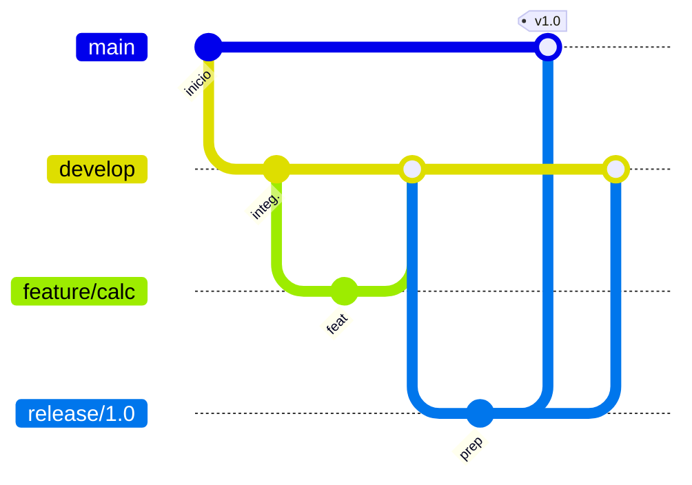

# GitFlow en este repositorio

## Ramas principales

| Rama | Propósito |
|------|-----------|
| `main` | Historial de producción. Solo recibe fusiones desde `release/*` o `hotfix/*`. Cada versión etiquetada aquí debe ser estable. |
| `develop` | Rama de integración del trabajo en curso. Es la base de las ramas `feature/*` y el origen de las `release/*`. |

## Ramas de apoyo

| Prefijo | Desde | Hacia | Uso |
|---------|-------|-------|-----|
| `feature/nombre-corto` | `develop` | `develop` (vía PR) | Nueva funcionalidad o mejora no urgente. |
| `release/x.y.z` | `develop` | `main` y de vuelta a `develop` | Congelar una versión, ajustes finales y metadatos antes del lanzamiento. |
| `hotfix/nombre-corto` | `main` | `main` y `develop` | Corrección urgente en producción sin esperar el ciclo normal de `develop`. |

## Flujo recomendado (resumen)

1. Actualizar `develop` desde el remoto.
2. Crear la rama: `git checkout -b feature/mi-tarea develop`.
3. Commits pequeños con mensajes según [COMMITS.md](COMMITS.md).
4. Subir la rama y abrir **pull request** hacia `develop`.
5. Tras revisión y CI en verde, fusionar (preferiblemente *squash* o *merge commit* según política del equipo).
6. Para publicar versión: crear `release/x.y.z` desde `develop`, ajustar versión o notas, PR a `main`, etiquetar.
7. Hotfix: ramificar desde `main`, corregir, PR a `main`, fusionar el mismo cambio en `develop`.

## Pull requests

Toda integración a `develop` o `main` debe hacerse mediante **pull request**, nunca con push directo a estas ramas en el remoto. La plantilla del repositorio ayuda a documentar el alcance y la revisión.

## Relación con CI/CD

Los workflows se ejecutan en push y PR hacia `main` y `develop`. Mantén las ramas de feature actualizadas con `develop` antes de fusionar para reducir conflictos y fallos de integración.
